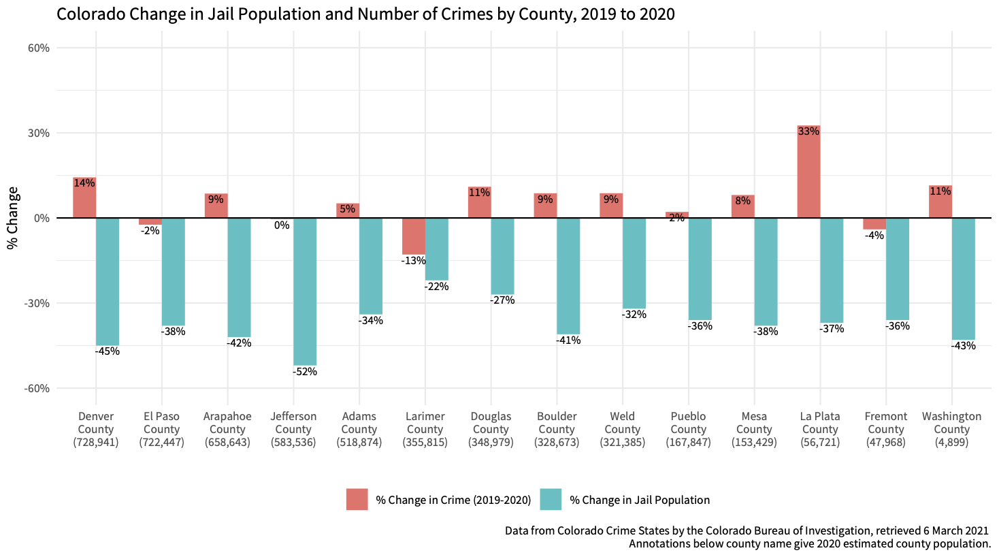
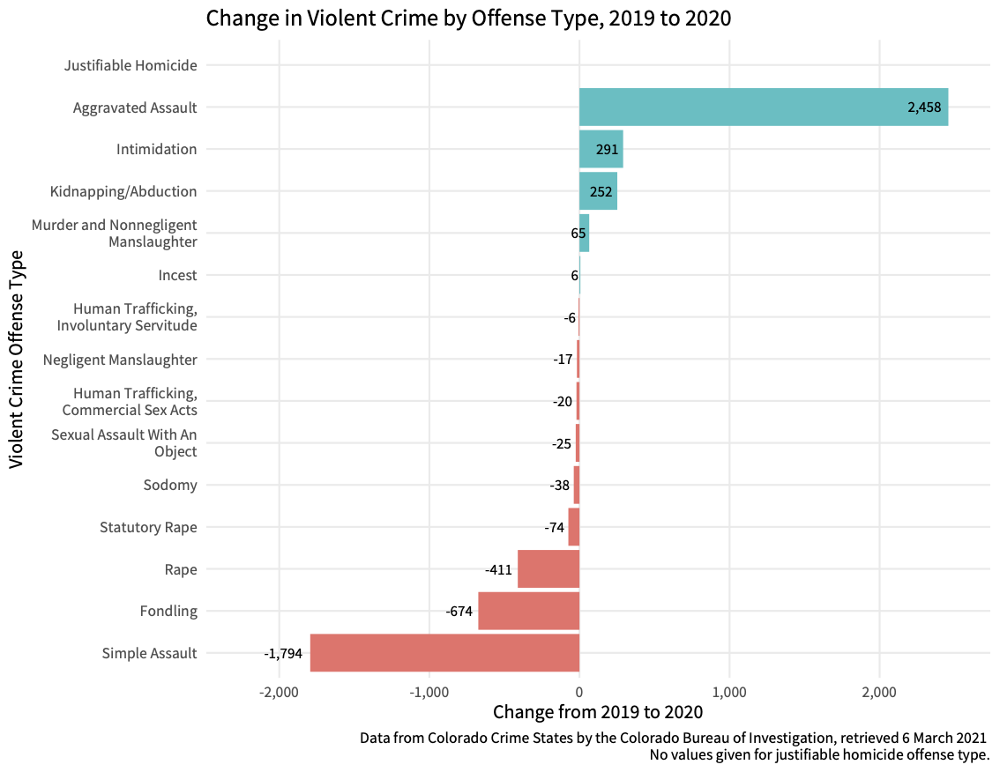
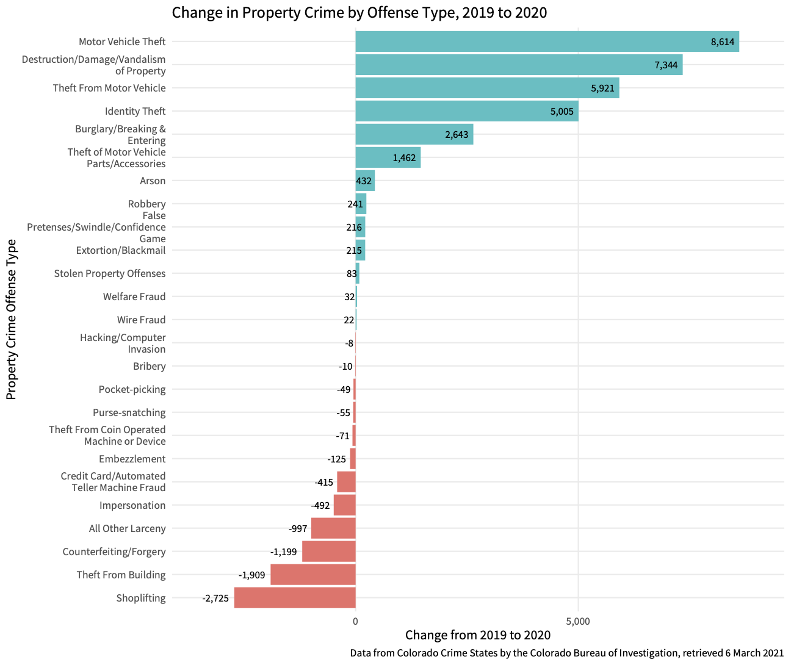
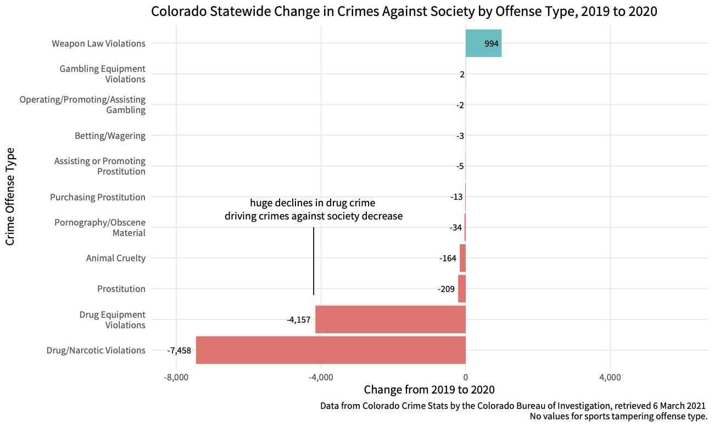

# Colorado Crime Data - 2019 & 2020
comparing 2019 and 2020 crime data for the ACLU of Colorado to make a case to continue COVID-related decarceration into 2021 by showing no link between
decarceration rates by county and crime. 

Data Source: [Colorado Crime Stats data base](https://coloradocrimestats.state.co.us/public/Browse/browsetables.aspx?PerspectiveLanguage=en)

## Notes: 

* Adams County reported exactly the same number of violent crimes (14,018) in 2019 and 2020, which suggest a possible error in source data.

# Findings

Crimes against society decreased from 2019 to 2020, crimes against persons stayed the same, increase in property crime accounts for the entirety of the increase in crime from 2019 to 2020. 

## By County

Most of the fourteen most populous counties saw an increase in property crime, decrease in "crimes against society" and little or no change in crimes against persons. 

# Jail Decarceration

No statistically significant relationship between % decarceration and % change in crime. 

Offense types show no relationship to decarceration. 

# Detailed Offense Types 

The increase in aggravated assaults is almost entirely offset by the decrease in simple assaults (are they upcharging?) and decreases in rape and fondling also drive down the overall violent crime rate. 

Motor vehicle thefts, vandalism, car break-ins, and identity theft are driving the increase in property crime. 

Huge declines in drug crime are driving the "crimes against society decrease".

