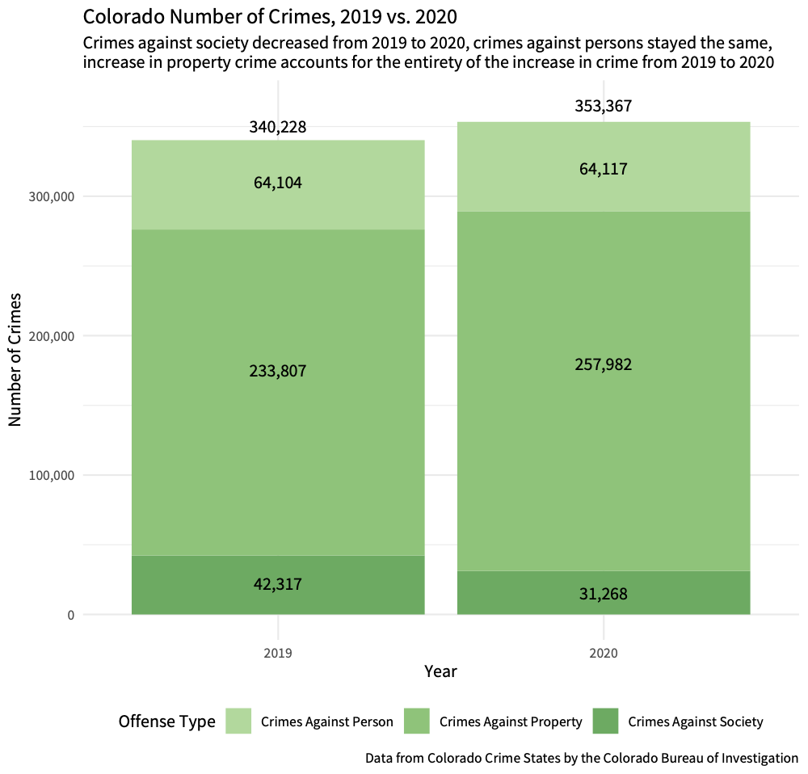
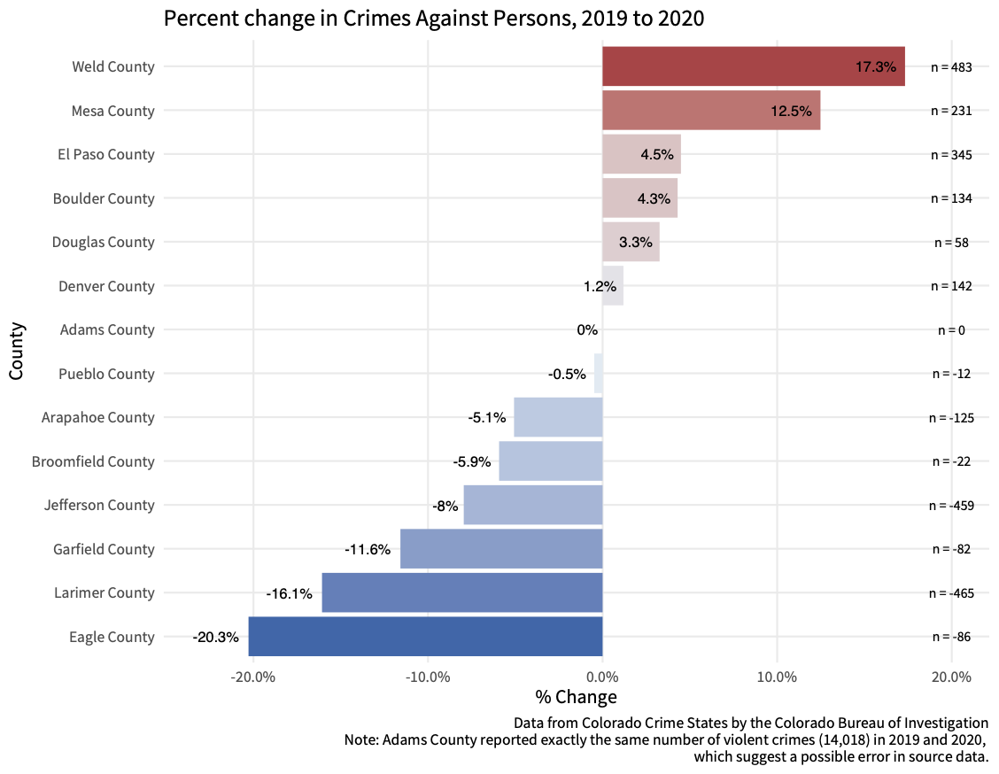
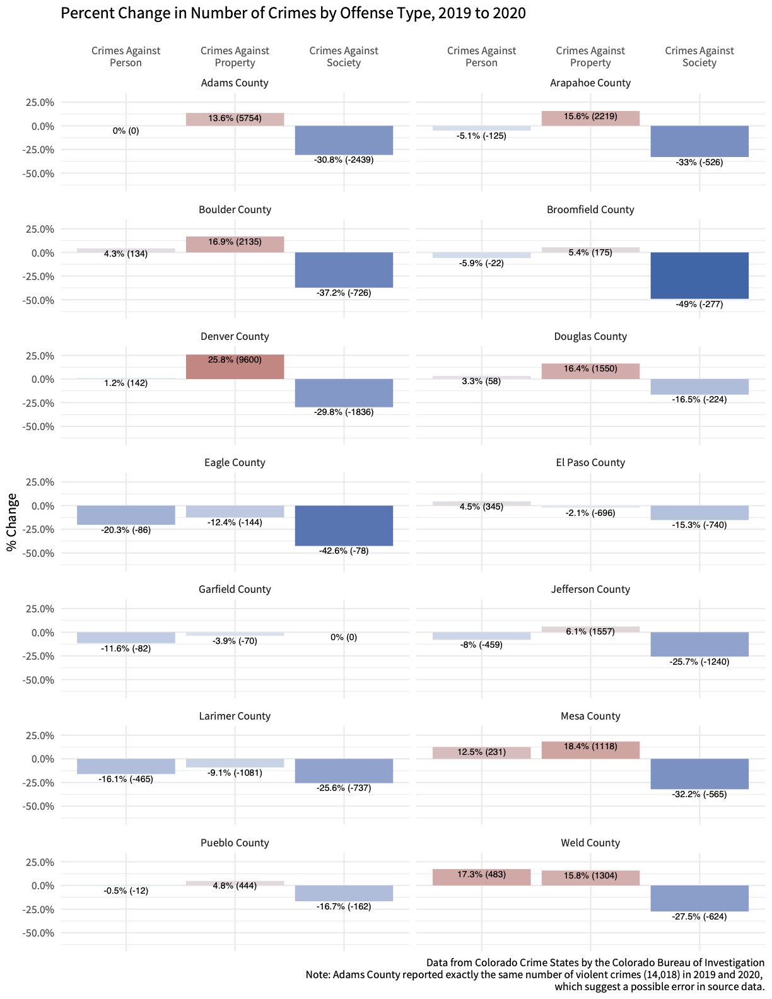

# COCrimeData
comparing 2019 and 2020 crime data for the ACLU of Colorado

## Notes: 

* Adams County reported exactly the same number of violent crimes (14,018) in 2019 and 2020, which suggest a possible error in source data.

# Findings

Crimes against society decreased from 2019 to 2020, crimes against persons stayed the same, increase in property crime accounts for the entirety of the increase in crime from 2019 to 2020. 

## All Colorado

## By County

## Percent Change

