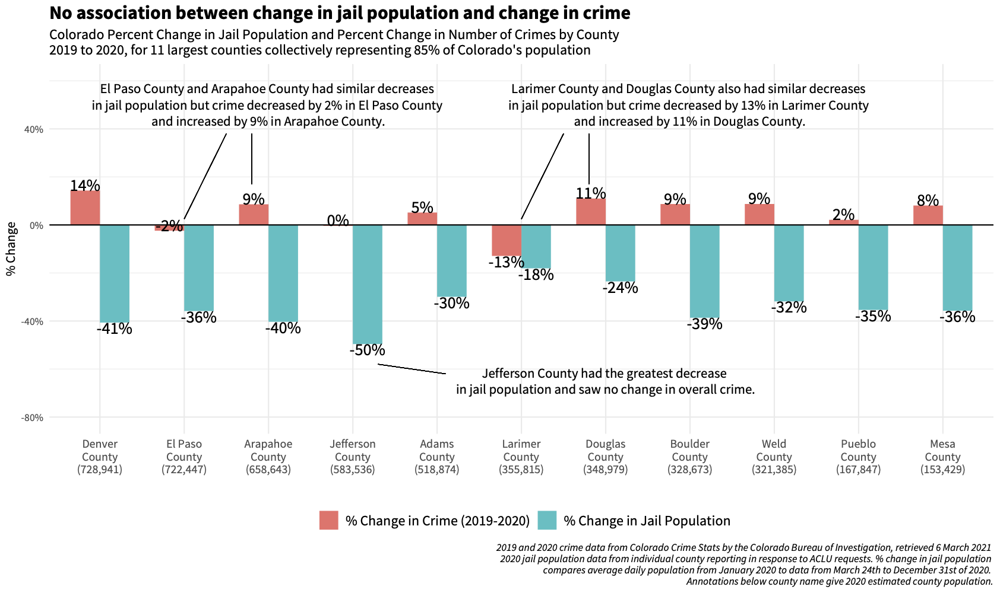
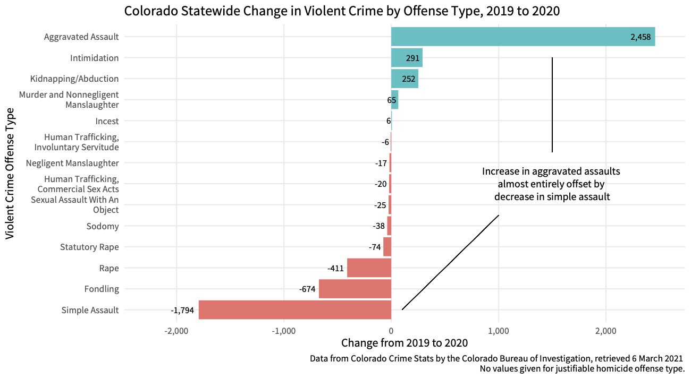
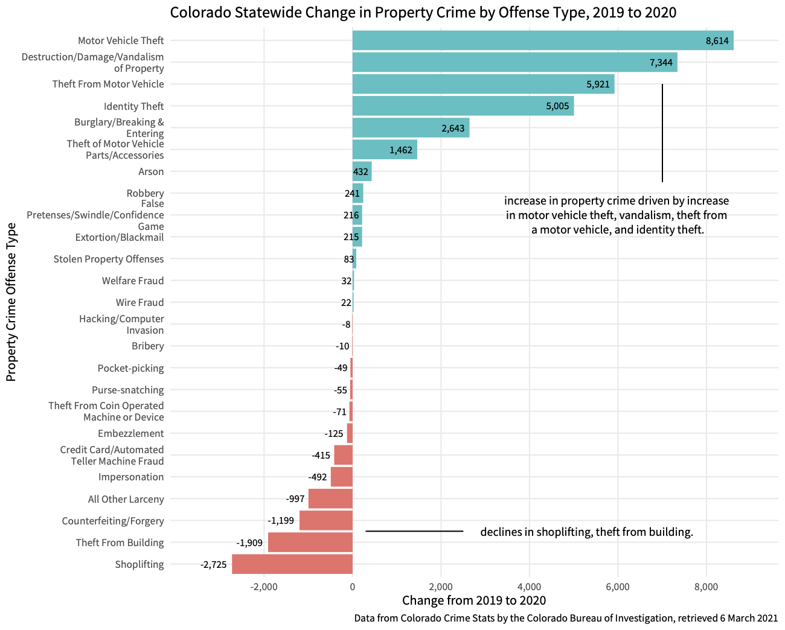

# Colorado Crime Data - 2019 & 2020
comparing 2019 and 2020 crime data for the ACLU of Colorado to make a case to continue COVID-related decarceration into 2021 by showing no link between
decarceration rates by county and crime. 

Data Source: [Colorado Crime Stats data base](https://coloradocrimestats.state.co.us/public/Browse/browsetables.aspx?PerspectiveLanguage=en)

## Notes: 

* Adams County reported exactly the same number of violent crimes (14,018) in 2019 and 2020, which suggest a possible error in source data.

# Findings

Crimes against society decreased from 2019 to 2020, crimes against persons stayed the same, increase in property crime accounts for the entirety of the increase in crime from 2019 to 2020. 

# Jail Decarceration

The data shows no statistically significant association between percent decrease in county jail population and percent change in crime. Douglas County and Larimer County are an illustrative example - the two counties had similar decreases in jail population (24% and 18% respectively) and overall crime increased by 11% in Douglas County and decreased by 13% in Larimer County. Similarly, El Paso County and Arapahoe County had similar decreases in jail population (36% and 40% respectively) and overall crime decreased by 2% in El Paso County and increased by 9% in Arapahoe County. 

Jail depopulation does not have any measured association with crime rates.

This finding also holds when comparing percent decrease in jail population to crime by offense type: there is no statistically significant association between percent decrease in county jail population and percent change in violent crime, property crime, or other crime types.

# Detailed Offense Types 

The increase in aggravated assaults is almost entirely offset by the decrease in simple assaults (are they upcharging?) and decreases in rape and fondling also drive down the overall violent crime rate. 

Motor vehicle thefts, vandalism, car break-ins, and identity theft are driving the increase in property crime. 

Huge declines in drug crime are driving the "crimes against society decrease".

